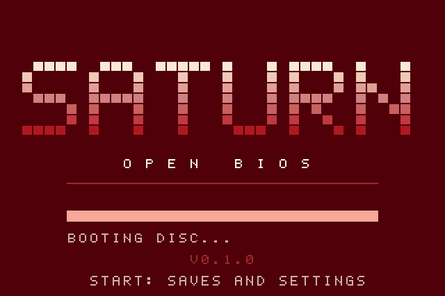
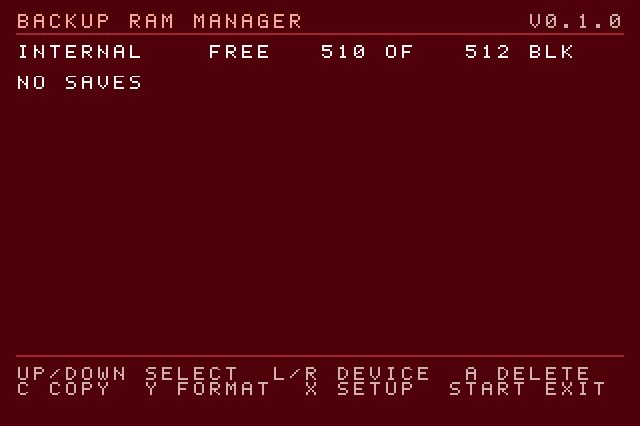
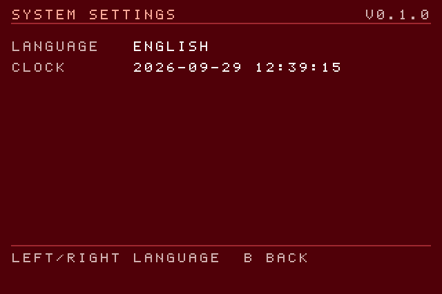
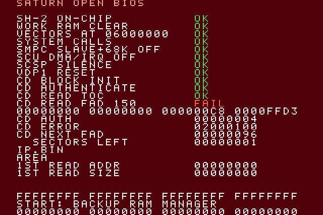
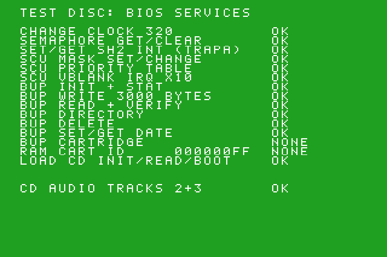

# SaturnOpenBios

A free, clean-room replacement boot ROM (BIOS) for the Sega Saturn, for
emulators and the MiSTer FPGA Saturn core. GPL-2.0-or-later.

## The story

This is a little hobby project. I wanted to play all of my Saturn games on
MiSTer without needing a real Sega BIOS, so I set out to build an open one
that boots real discs, keeps saves working and plays CD music. It is not
meant to replace the original for everyone, and it is certainly not
finished, but it runs every game I own and have tried.

## What it does

- Boots Saturn discs: initialises the hardware, reads the disc, loads
  IP.BIN and the first program, and hands over to the game in the state
  games expect from a Saturn (checked against the original on MiSTer).
- The system calls games use: interrupt dispatch and priorities, SH-2 and
  SCU interrupt vectors, semaphores, clock change, and the "load CD" calls
  used by boot loaders.
- Backup RAM library for the internal memory and backup RAM cartridges
  (blank internal memory is formatted at boot), plus a manager to delete,
  copy and format saves.
- System settings: the console language, stored where games read it, and
  the clock.
- Cartridge boot for Action Replay style ROM cartridges (tested with
  Pseudo Saturn Kai Lite).
- Tap **Start** during the boot screen to open the backup RAM manager and
  settings before the game starts; with no disc it opens by itself and
  boots a disc as soon as one is inserted.

| Backup RAM manager | Settings |
|---|---|
|  |  |

If a boot step fails, the full step list and some diagnostics are shown
instead of the boot screen:

## Compatibility

Games I own and tried, on MiSTer (Saturn core) and in Kronos (RetroArch).
"Plays" means it boots and runs, with CD music where the game has it.

| Game | Region | MiSTer | Kronos | Notes |
|---|---|---|---|---|
| Clockwork Knight | JP | Plays | Plays | |
| Die Hard Arcade | JP | Plays | Title screen | |
| House of the Dead, The | JP | Plays | Title screen | Some flicker and slowdown; may be the original game |
| Panzer Dragoon | JP | Plays | Intro plays | FMV fine |
| Shutsudo! Minisuka Police | JP | Plays | Black screen | Also black with Kronos's own built-in BIOS |
| Sonic R | EU | Plays | Title screen | |
| Virtua Cop | JP | Plays | Attract mode | |
| Virtua Cop 2 | EU | Plays | Boots | |

On MiSTer, use CHD images, or cue sheets without a `PREGAP` line: with an
unstored pregap the MiSTer's drive emulation plays the wrong audio (the end
of the data track) instead of the CD music. This is not a BIOS issue.

Not supported: the audio CD player, and Video CD / Photo CD (they need the
MPEG card).

### Pseudo Saturn Kai

Pseudo Saturn Kai (PSKAI) boots as a cartridge: on MiSTer set the OSD
**Cartridge** option to **ROM 2M** and load the cartridge file with "Load
cartridge". Use the Lite version (`PSKAI256.BIN`, from
`lite/pskai_flasher_lite.iso` in the PSKAI release): the full version looks
for an SD card adapter that MiSTer does not have (X+Y+Z skips that check).

- Its menu, and starting a game with its default "JHL" loader, go through
  this BIOS's documented "load CD" system calls.
- **Cheat codes do not work.** With cheats enabled PSKAI uses its "CWX"
  loader, which starts the game the way Sega's BIOS does: it runs the
  disc's security code, and that code calls into fixed places inside
  Sega's BIOS ROM. Supporting it would mean imitating undocumented Sega
  BIOS internals behind the copy protection, which this project does not
  do. For cheats, use PSKAI with the original BIOS.

## Using it on MiSTer

1. Build it (below), or take `boot.rom` from a release build.
2. Copy it to the SD card as `games/Saturn/boot.rom` (keep a copy of the
   one you have).
3. Load the Saturn core again (a reset is not enough), then load a game.

For saves to survive power-off, turn **Autosave** on in the Saturn core's
OSD, or use "Save Backup RAM" while the game is loaded.

## Building

    sudo apt install binutils-sh-elf yabause xvfb x11-apps imagemagick
    make          # -> build/saturn-open-bios.bin (512 KB), the ROM image
    make run      # boots the test disc in Yabause headlessly, saves build/screen.png
    make diag     # a build with diagnostics pages, in build/diag/

The version shown on screen comes from `git describe`. Layout: `src/` SH-2
sources and linker script, `testdisc/` the test disc (our own IP.BIN and a
program that tests the BIOS services), `tools/` build and test scripts,
`docs/PLAN.md` notes and research.

## How it was made

Everything here is written from scratch in SH-2 assembly. No code or data
from Sega's BIOS is included, and Sega's BIOS was never disassembled; the
original was only used as a black box on MiSTer to compare the hardware
state it leaves behind. The disc's security code is never run.

Hardware behaviour was worked out from public documentation and by reading
open-source projects as references: the Yabause, Kronos and Mednafen
(Beetle Saturn) emulators, the MiSTer Saturn core, and the iapetus and
Pseudo Saturn homebrew libraries. None of their code is copied here; they
helped to understand what the hardware and games expect.

## Licence

GPL-2.0-or-later (see `COPYING`).
